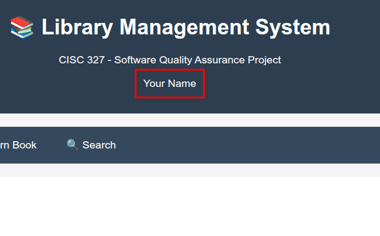

# Student Instructions - Assignment 1

## Project: Library Management System

### Project Overview

To get the overview of the project, please check the `readme.md` file.

### Task to Complete

You have been provided with a **Flask web application** for a Library Management System. Your task is to:
1. Set up the development environment and make sure the application is running in your computer
2. Report project implementation status by identifying missing elements specific to functions, logic, conditions described in [Requirements Specification File](requirements_specification.md)
3. Write unit tests for all the functionalities
4. Submit the assignment by pushing your local repository in GitHub.


The details of the above tasks are given below.

### 1. Environment Setup

Make sure you have Python installed and a code editor like VSCode or PyCharm. Then, clone the repository to your local machine.

```bash
# Create virtual environment
python -m venv venv

# Activate virtual environment
source venv/bin/activate  # On Windows: venv\Scripts\activate

# Install dependencies
pip install -r requirements.txt
```

Run the application:

```bash
python app.py
```
Visit `http://localhost:5000` to see the web interface. 

Change the banner to add your name in place of "your name" shown in the image



### 2. Project Implementation Status

Report your findings in a table with columns function name, implementation status (complete/partial), what is missing (if any) and save in a markdown file named `A1_LastName_last4digitID.md`. Make sure you write your name, ID and group number at the top of the file.


### 3. Writing Unit Test
- Write unit test script using python pytest framework for all the functionalities specified in `requirements_specification.md` file
- For each function, write at least 4-5 test cases, including positive and negative test cases
- Create a separate folder named `tests` and store the test script file there. You may create separate script files for each function
- Update the `A1_LastName_last4digitID.md` file to include a summary of the tests scripts
- A sample of test script is given in [`sample_test.py`](sample_test.py) file  

### 4. Submission
- See the submission instructions in OnQ.

 


